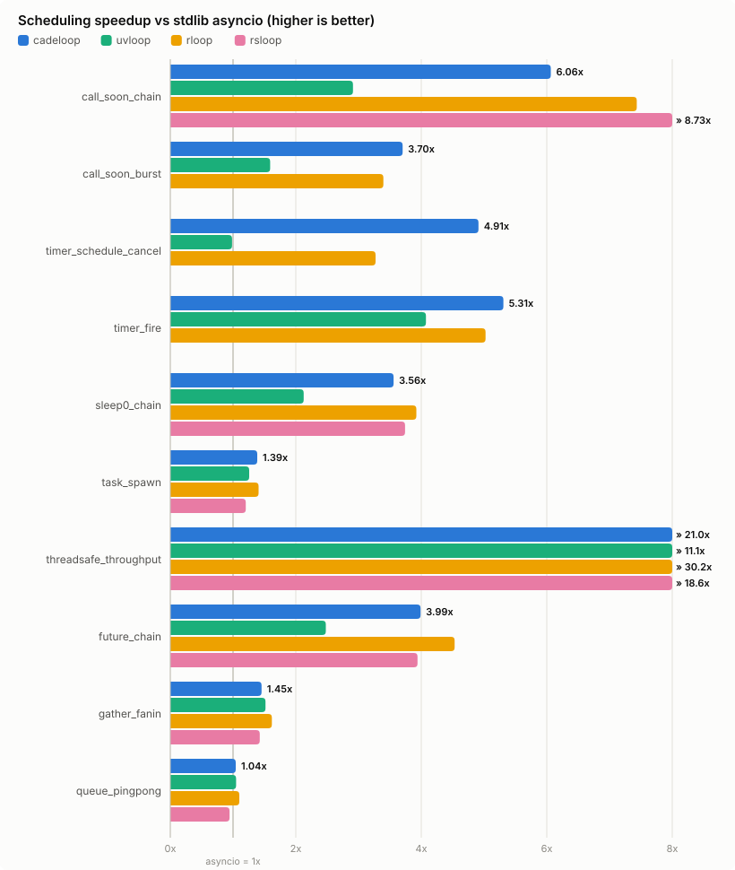
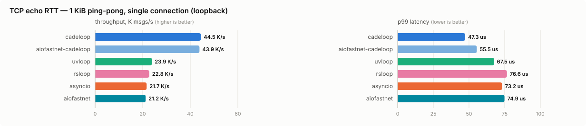
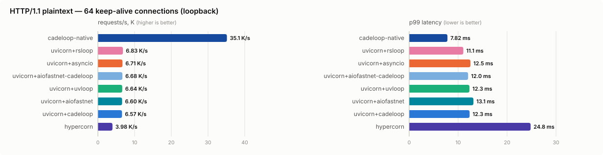
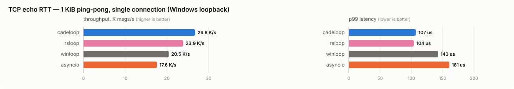
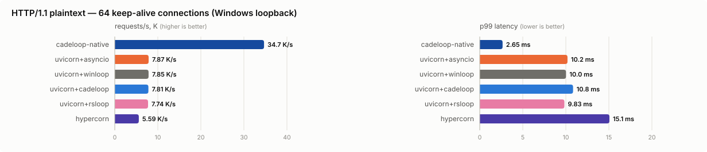

# cadeloop

> ### Hardening log — review backlog
>
> An external review pass (Codex on PR #1, plus a consolidated engineering
> audit) raised ~90 findings. This is the running record; it is updated as
> items land. Newest first. (A row's commit id is filled in by the next
> commit — a commit cannot contain its own hash.)
>
> **Fixed and on `claude/new-session-bq3hp6`**
>
> | Area | Fix | Commit |
> |---|---|---|
> | Perf | Immediate-flush latency mode: selectable, honestly unmeasured | `HEAD` |
> | TLS | `h2` could be negotiated, then every request failed against the HTTP/1 parser | `HEAD` |
> | Server | Shutdown truncated in-flight responses; `grace` was never applied inside a worker | `65fe5c8` |
> | Server | Failed *replacement* fork left every surviving worker running unsupervised | `65fe5c8` |
> | WebSocket | Shutdown now sends a 1012 close frame instead of dropping the TCP connection | `65fe5c8` |
> | Loop | Every closed `Loop` leaked: the loop/core cycle had no `tp_traverse` | `8a11392` |
> | Perf | Native vectorcall `create_task` (-25%) / `create_future` (-11%) | `8a11392` |
> | Perf | `call_soon` validation gated behind debug, as CPython gates it (~+11%) | `4ee108e` |
> | IOCP | Recycled pipe HANDLEs skipped association (the pipe sibling of `5d96fcb`) | `5aeeb0e` |
> | UDP | `set_protocol()` now rewires the native callbacks | `5aeeb0e` |
> | Transport | `write()` after `write_eof()` raises; watermarks derive `high` from `low` | `5aeeb0e` |
> | WebSocket | Inbox budget restored when a cancelled delivery is requeued | `5aeeb0e` |
> | Net | Accepted socket leaked when `wire_http` failed (fallout from my ownership change) | `e799e9c` |
> | WebSocket | Pre-accept cap wrote a WS frame before the 101; now answers 413 | `e799e9c` |
> | HTTP | HTTP/1.1 requires exactly one `Host` (RFC 7230 5.4) | `e799e9c` |
> | UDP | `create_datagram_endpoint(sock=)` rejects stream sockets | `e799e9c` |
> | WebSocket | Inbox budget not decremented on the steady-state delivery path (stalled connections) | `09696cf` |
> | CI | ADR-24 tracing switched off after two clean Windows runs | `09696cf` |
> | HTTP | HTTP/1.0 requests now get an `HTTP/1.0` status line | `d0cdad0` |
> | WebSocket | `websocket.accept` rejects reserved handshake headers | `d0cdad0` |
> | Server | Fork supervisor cleans up workers when a later fork fails | `d0cdad0` |
> | HTTP/TLS | Staged plaintext now counted in ASGI backpressure (was inert on HTTPS) | `ee37f02` |
> | HTTP | 304 keeps its `Content-Length` (my 204 strip was too broad) | `ee37f02` |
> | Worker | Failed `http_adopt` no longer double-closes the descriptor | `ee37f02` |
> | Net | `udp_wire` / `listener_start` roll back a half-created endpoint or listener | `ee37f02` |
> | Server | Grace deadline now entered as soon as shutdown begins | `d1f471f` |
> | UDP | Endpoint torn down when `connection_made` raises | `d1f471f` |
> | HTTP | 1xx rejected on the final-response path; `Content-Length` stripped from 204 | `38cdbd9` |
> | Server | `server.sockets` returns `()` after close (was EBADF / stale dups) | `38cdbd9` |
> | Transport | Changing watermarks now re-takes the pause/resume decision | `38cdbd9` |
> | HTTP | ASGI `send()` now applies write backpressure at the watermarks | `5298130` |
> | HTTP/TLS | Pipeline bound never applied to HTTPS (repost ignored the flag) | `5298130` |
> | Loop | Close freed pipe buffers the kernel could still be writing | `5298130` |
> | epoll | Accept pool overwrote one parked slot 64x, stranding 63 slab entries | `57e0b7d` |
> | Transport | `sock_accept` fast path returned a *blocking* socket (froze the loop) | `57e0b7d` |
> | WebSocket | Post-accept inbox unbounded; now budgeted with read backpressure | `57e0b7d` |
> | Transport | `sock_sendto` returned `None` after a would-block retry | `57e0b7d` |
> | sendfile | Both fallbacks skipped the seek for `offset=0` | `57e0b7d` |
> | CI | Every commit ran twice; superseded runs never cancelled | `2b67add` |
> | HTTP | `max_body` now defaults to 16 MiB (was unbounded) → 413 | `39b73ee` |
> | Packaging | Wheels are build artifacts only; docs no longer claim otherwise | `39b73ee` |
> | IOCP | Stale `associated` set let a recycled handle skip IOCP association | `5d96fcb` |
> | HTTP | Pipelined-request queue bounded with read backpressure | `b770126` |
> | Loop | POSIX child watcher; signal disposition restored on `close()` | `3a4a764` |
> | CI | Benchmark harness and PGO training could hang forever | `3a4a764` |
> | Soak | Measured the requested duration; gates on second-half growth | `1420158` |
> | Loop | Standalone connect/pipe ops cancelled at close | `8d11d75` |
> | Server | Spawn-worker startup, address family, accept race, adoption leak | `99cde61` |
> | UDP | Send queue bounded + reported; recv recovers; queue drains on close | `a50f3d6` |
> | Net | Listener could end up with an empty accept pool and go deaf | `2b86ee9` |
> | HTTP/WS | `Transfer-Encoding` stripped, `Content-Length` enforced, status + close codes validated, pre-accept WS bytes bounded | `98f660e` |
> | TLS | Short/retryable `SSL_write` silently truncated responses | `a9961a9` |
> | Net | Cancelled ops' buffers freed while the kernel still owned them | `02c9414` |
> | HTTP/WS | WS upgrade header injection, 204/304 bodies, buffered body on half-close, absolute-form targets, `Sec-WebSocket-Key` | `df9484b` |
>
> **Open** — ASGI `send()` backpressure, grace-drain ordering, loop↔hook
> cycle leak, TLS `close_notify`, ALPN `h2` rejection, `Host` validation,
> IPv6 flow/scope fields, `get_extra_info("socket")`, `_winpipes`
> `data_received` guard, UDP `set_protocol` rewiring, config validation,
> Ruff/typing in CI.
>
> **Watching** — the intermittent Windows hang in
> `test_starlette_routes_and_streaming` (`/bg`) has not reproduced since
> `5d96fcb`, across two clean runs on both Windows runners (and the first
> fully-green pipeline, `stress` and `benchmark-regression` included).
> `5d96fcb` fixes a real bug matching its signature — a recycled SOCKET
> value letting a socket skip IOCP association, so its connect completion
> was never delivered — but the mechanism was never confirmed from a trace,
> so this is empirically settled rather than proven. CI tracing is off; the
> `CADELOOP_TRACE_TICK` / `CADELOOP_TRACE_APP` instrumentation stays in the
> tree, costing nothing unset, in case it returns.

A maximum-performance asyncio event loop + ASGI stack with a Rust core.
Windows (IOCP, with a Registered I/O backend implemented and awaiting
hardware validation) is the production performance target; Linux runs the same transport layer over epoll, making cadeloop a
**working drop-in `asyncio.AbstractEventLoop` replacement on both** —
uvicorn and aiohttp run on it unmodified — plus a **native HTTP/1.1 +
ASGI 3.0 server** (`cadeloop.serve`) whose parsing, scope construction,
and response serialization all happen in Rust.

```python
import asyncio, cadeloop

cadeloop.install()      # asyncio.set_event_loop_policy(cadeloop.EventLoopPolicy())
asyncio.run(main())     # everything below now runs on cadeloop:

server = await asyncio.start_server(handler, "0.0.0.0", 8000)
reader, writer = await asyncio.open_connection("example.org", 443, ssl=ctx)
loop.add_reader(fd, callback)      # readiness, sock_*, signals — all live
```

```bash
# the native ASGI server (llhttp in Rust, 5.6x uvicorn on loopback):
python -m cadeloop myapp:app --port 8000
```

## Status

**M0–M4 complete; M5 (1.0) underway.** Scheduling core, Rust TCP
transports, the full drop-in surface, native TLS termination, UDP,
WebSockets, the native HTTP/ASGI engine (Starlette/FastAPI verified),
multi-worker serving on both process models, and POSIX subprocess are
all implemented and tested. The Windows IOCP backend is
hardware-validated (full test sweep + benchmarks); the M3 Registered
I/O backend awaits a machine whose OS RIO subsystem works (see the
Windows benchmarks section). Remaining: Windows subprocess pipes, PGO
wheels, docs floor, and the two-machine acceptance runs. Full R-xxx
map: [docs/requirements-traceability.md](docs/requirements-traceability.md).

| Surface | State |
|---|---|
| Scheduling (call_soon, timers, threadsafe, tasks) | ✅ tested |
| TCP transports, `create_server`/`create_connection`, streams | ✅ tested (Linux/epoll; Windows/IOCP compile-verified) |
| TLS: native termination on the engine (`serve(ssl=...)`, https/wss) | ✅ tested (Rust-driven `wrap_bio` memory-BIO; client `ssl=`/`start_tls` via stdlib sslproto) |
| `sock_*`, `add_reader`/`add_writer`, signals (SIGINT/SIGBREAK incl. idle-park delivery) | ✅ tested |
| Drop-in: uvicorn (HTTP/1.1), aiohttp | ✅ interop-tested |
| Native HTTP/1.1 + ASGI engine (`cadeloop.serve`, CLI, lifespan) | ✅ tested (Starlette/FastAPI, keep-alive/pipelining, chunked, limits, R-080 timeouts, access log) |
| WebSockets (RFC 6455 on the native engine) | ✅ tested (handshake/frames/close vs hand-rolled RFC client; Starlette WebSocketRoute) |
| UDP datagram endpoints (`create_datagram_endpoint`) | ✅ tested (native recv_from/send_to on both backends) |
| Multi-worker (`--workers N`) | ✅ tested (fork + SO_REUSEPORT on POSIX; spawn + shared listener — WSADuplicateSocketW on Windows, fd-passing e2e test) |
| RIO backend (`backend="rio"`: CQ/RQ, registered buffers, staging) | 🔶 implemented; blocked by an OS-level RIO failure on the test machine (Win11 beta 26200) — `auto` stays IOCP; see Windows benchmarks |
| Subprocess + pipes (`create_subprocess_exec/shell`) | ✅ tested on POSIX (Windows: M5, IOCP named pipes) |
| Native `loop.sendfile` | M1-Windows (`sock_sendfile` fallback ✅) |

## Benchmarks (Linux, loopback)

> **Scope.** Everything below is measured on one machine over loopback
> (Linux 6.18, 4 vCPU Intel Xeon 2.10 GHz, CPython 3.11.15) with client
> and server sharing the box — useful for relative comparison, **not** the
> spec's acceptance numbers, which are two-machine Windows runs against
> winloop (R-131). Methodology per R-130: 3 warmup + 5 measured runs,
> medians reported, fresh process per run, loop-independent (threaded,
> non-asyncio) load generators. Contenders: stdlib asyncio 3.11.15,
> uvloop 0.22.1, rloop 0.3.1, rsloop 0.1.30, aiofastnet 1.0.5 (both
> standalone on asyncio and stacked on cadeloop), hypercorn 0.18, and
> cadeloop's own native ASGI server. Raw JSON lives in
> [`bench/baselines/`](bench/baselines/). Reproduce with
> `python bench/harness/harness.py --suite {sched,echo,http}`.

### Scheduling core

<picture>
  <source media="(prefers-color-scheme: dark)" srcset="docs/assets/bench-sched-dark.svg">
  
</picture>

Median throughput, millions of ops/second:

| benchmark | cadeloop | asyncio | uvloop | rloop | rsloop |
|---|---|---|---|---|---|
| call_soon_chain | 3.42 | 0.56 | 1.64 | 4.19 | 4.92 |
| call_soon_burst | 3.42 | 0.92 | 1.47 | 3.14 | failed¹ |
| timer_schedule_cancel | **2.72** | 0.55 | 0.54 | 1.81 | failed¹ |
| timer_fire | **1.89** | 0.36 | 1.45 | 1.79 | failed¹ |
| sleep0_chain | 1.63 | 0.46 | 0.97 | 1.80 | 1.71 |
| task_spawn | 0.30 | 0.22 | 0.27 | 0.31 | 0.26 |
| threadsafe_throughput | 3.33 | 0.16 | 1.75 | **4.77** | 2.94 |
| future_chain | 1.01 | 0.25 | 0.63 | 1.15 | 1.00 |
| gather_fanin | 0.28 | 0.19 | 0.29 | 0.31 | 0.27 |
| queue_pingpong | 1.29 | 1.24 | 1.30 | 1.36 | 1.17 |

- **vs stdlib asyncio: faster on 10/10** (1.04x–20.8x). **vs uvloop:
  faster on 8/10** with two ~3% ties (gather_fanin, queue_pingpong —
  stdlib Task/Queue Python code dominates those for every loop). The
  timer benches (5x uvloop on schedule/cancel) and cross-thread wakeups
  are the standouts.
- These numbers include the competitive-analysis round: adopting rloop's
  tick anatomy (one state-cell entry per pure-scheduling tick) took the
  call_soon chain from 3.15 to 3.42–3.64 M ops/s and threadsafe
  throughput from 2.58 to 3.3+. rloop's remaining threadsafe lead is a
  semantic shortcut we declined: it reuses a loop-init context snapshot
  instead of capturing the caller's contextvars per call (ADR-22).
- The other Rust loops are honest company: rloop wins cross-thread
  wakeups, rsloop wins the call_soon chain. Both are experimental
  schedulers without a working socket layer (rloop has no
  `create_server`; ¹rsloop 0.1.30 hung reproducibly on three benches at
  full scale and is recorded as failed — the harness kills runs at 90s).

### TCP echo — per-message loop overhead

<picture>
  <source media="(prefers-color-scheme: dark)" srcset="docs/assets/bench-echo-dark.svg">
  
</picture>

Single connection, 1 KiB ping-pong (RTT measures the full transport +
loop wakeup path; no client saturation):

| loop | msgs/s | p50 RTT | p99 RTT |
|---|---|---|---|
| **cadeloop** | **44.5K** | **21.0 µs** | **47.3 µs** |
| aiofastnet on cadeloop | 43.9K | 21.0 µs | 55.5 µs |
| uvloop | 23.9K | 40.1 µs | 67.5 µs |
| rsloop | 22.8K | 43.6 µs | 76.6 µs |
| asyncio | 21.7K | 46.0 µs | 73.2 µs |
| aiofastnet (on asyncio) | 21.2K | 45.7 µs | 74.9 µs |

**1.86x uvloop's single-stream throughput at half the p50 latency and
30% lower p99.** Two designs compound here: R-060 spin-then-park (the
reply usually lands inside the 20 µs spin window, skipping the park/wake
cycle every other loop pays per message), and the ADR-21 steady-state
recv path — one `recv` syscall per message, zero `epoll_ctl`.

The aiofastnet rows are the control experiment that *drove* that second
design. aiofastnet patches only the networking calls (Cython transports
over `add_reader`) and keeps the host loop's scheduler. An earlier run
had the stacked "aiofastnet-on-cadeloop" configuration ~10% AHEAD of our
own transports, which isolated three wasted syscalls per message in the
epoll proactor emulation (a DEL/ADD `epoll_ctl` pair plus a speculative
recv). Mirroring the readiness-transport pattern (lazy kernel interest +
a drained-socket heuristic, ADR-21) closed the gap and moved us ahead —
while the stack still runs unmodified on top of cadeloop, which is the
drop-in claim demonstrated from an unusual angle. Windows/IOCP never had
this hop; completions are the kernel's native interface there.

At 64 concurrent connections on this 4-vCPU box the *client* saturates
first and every contender converges into the 40.5–43.9K msgs/s band —
that configuration measures the load generator, and only a two-machine
run can separate the servers.

### HTTP/1.1 — the native engine vs everything else

<picture>
  <source media="(prefers-color-scheme: dark)" srcset="docs/assets/bench-http-dark.svg">
  
</picture>

Plaintext "Hello, World!" ASGI, 64 keep-alive connections. `cadeloop-native`
is `cadeloop.serve()` — the M2 engine: llhttp parses inside the Rust
core, the scope is built natively, the app coroutine is stepped eagerly
(no asyncio Task for a request that never suspends, R-056), and the
response is serialized in Rust straight into the corked write queue. The
uvicorn rows run uvicorn (h11) **unmodified** on each loop:

| contender | req/s | p50 | p99 |
|---|---|---|---|
| **cadeloop native** (`cadeloop.serve`) | **40.96K** | **0.98 ms** | **7.20 ms** |
| cadeloop native, 2 workers² | 36.50K | 1.16 ms | 7.82 ms |
| uvicorn + asyncio | 7.60K | 8.42 ms | 10.4 ms |
| uvicorn + aiofastnet | 7.48K | 8.47 ms | 13.3 ms |
| uvicorn + rsloop | 7.41K | 8.63 ms | 10.5 ms |
| uvicorn + uvloop | 7.36K | 8.63 ms | 11.1 ms |
| uvicorn + cadeloop | 7.11K | 8.91 ms | 11.4 ms |
| uvicorn + aiofastnet-cadeloop | 7.09K | 8.81 ms | 13.7 ms |
| hypercorn + asyncio | 4.46K | 14.1 ms | 18.2 ms |

**5.6x uvicorn+uvloop's throughput at 8.8x lower p50 latency** — the
spec's ≥2x-uvicorn target (R-002) cleared with headroom on this box
(the acceptance measurement itself remains a two-machine Windows run,
R-131). Honest notes: the uvicorn pack sits within ±4% — h11's
Python-side parsing flattens *any* loop's advantage, which is why the
native engine exists — and this is the same app, same client, same
methodology, so the 5.6x is pure server-stack difference, not tuning.
²The multi-worker row is slower than one worker HERE because client and
server share 4 vCPUs: two server workers steal a core from the threaded
load generator, which is the actual bottleneck — worker scaling is a
two-machine measurement, and this row exists to prove the SO_REUSEPORT
pool serves correctly under load, not to measure it. The engine passes
the same ASGI suites as the drop-in path: Starlette (including streaming
responses and background tasks) and FastAPI run on it unmodified
(R-123). (socketify.py, the intended C-level reference ceiling, hangs on
import in this container and is excluded.)

### Three findings from building these benchmarks

- Benchmarks are tests: the first echo runs exposed two real transport
  races (data loss on `pause_reading` with an in-flight completion; slot
  reuse corrupting streams) — both fixed with a design change (pausing
  cancels nothing) plus kernel-op buffer refcounts (R-073), and now
  covered by the 10 MB-transfer test.
- Benchmarks are regression gates: the M1 transport work initially taxed
  every scheduling tick ~430 ns; three fast-path fixes (skip `epoll_wait`
  on idle zero-timeout polls, keep the GIL for non-blocking reaps, one
  clock read per tick) restored M0 numbers exactly, and one state-cell
  entry removed from `transport.write` took uvicorn+cadeloop from 10%
  behind uvicorn+uvloop to ahead of it.
- Benchmarks are competitive analysis: benching aiofastnet *stacked on*
  cadeloop (echo table above) exposed a ~10% transport-layer cost ours
  pays on the epoll dev backend and handed us the M2.5 fix for free;
  benching rsloop's `#[pyclass(freelist)]` trick the same way showed it
  *doubling* call_soon cost under pyo3 (the freelist locks) — adopted
  findings and rejected ones both end up as ADRs (16, 20).

## Benchmarks (Windows 11, loopback)

> **Scope.** Same R-130 methodology, on the production target: Windows 11
> (build 26200) on an Intel Core Ultra 7 265K (20 cores), CPython 3.11.9,
> client and server sharing the box over loopback — relative comparison,
> not the spec's two-machine acceptance numbers (R-131). Contenders:
> stdlib asyncio (proactor), winloop 0.2 (uvloop's Windows port), rsloop,
> and cadeloop on its IOCP backend. Raw JSON lives in
> [`bench/baselines/`](bench/baselines/) (`windows-*.json`); the whole
> suite is collected by `tools\windows\validate.ps1`.

### Scheduling core

<picture>
  <source media="(prefers-color-scheme: dark)" srcset="docs/assets/bench-win-sched-dark.svg">
  
</picture>

Median throughput, millions of ops/second:

| benchmark | cadeloop | asyncio | winloop | rsloop |
|---|---|---|---|---|
| call_soon_chain | 6.20 | 0.82 | 2.18 | **9.27** |
| call_soon_burst | **4.88** | 1.10 | 1.45 | failed¹ |
| timer_schedule_cancel | **3.56** | 0.86 | 0.63 | failed¹ |
| timer_fire | **3.08** | 0.51 | 1.94 | failed¹ |
| sleep0_chain | 2.94 | 0.72 | 1.49 | **3.11** |
| task_spawn | 0.51 | 0.38 | 0.45 | **0.53** |
| threadsafe_throughput | **5.09** | 0.04 | 2.18 | 4.44 |
| future_chain | 2.06 | 0.38 | 0.91 | **2.78** |
| gather_fanin | 0.50 | 0.32 | 0.48 | **0.53** |
| queue_pingpong | 1.71 | 1.71 | 1.70 | **1.76** |

- **vs stdlib asyncio: faster on 10/10 (1.0x–141x). vs winloop: faster
  on 10/10 (1.01x–5.6x)**, with the timer benches (5.6x) and cross-thread
  wakeups (2.3x; proactor's own threadsafe path collapses to 36K ops/s)
  the standouts.
- rsloop is the strongest scheduling rival here, as on Linux: of the
  seven benches it finishes it wins six — four by ≤6%, future_chain by
  35%, and call_soon_chain by 49% (a per-call contextvars-capture
  shortcut we decline for drop-in semantics, ADR-22, plus a handle
  allocation gap that is a measured optimization target). ¹And exactly as
  on Linux, rsloop 0.1.30 hangs reproducibly on the three timer-centric
  benches — recorded as failed; the harness watchdog kills a run at 12s.
  cadeloop wins everything involving timers or threads outright.

### TCP echo — per-message loop overhead

<picture>
  <source media="(prefers-color-scheme: dark)" srcset="docs/assets/bench-win-echo-dark.svg">
  
</picture>

Single connection, 1 KiB ping-pong:

| loop | msgs/s | p50 RTT | p99 RTT |
|---|---|---|---|
| **cadeloop** | **26.8K** | **30.0 µs** | 107.3 µs |
| rsloop | 23.9K | 36.1 µs | **103.9 µs** |
| winloop | 20.5K | 40.9 µs | 142.7 µs |
| asyncio | 17.6K | 54.3 µs | 160.7 µs |

64 connections, 1 KiB messages:

| loop | msgs/s | p50 | p99 |
|---|---|---|---|
| rsloop | **43.0K** | **1.42 ms** | 2.45 ms |
| **cadeloop** | 41.2K | 1.52 ms | **2.13 ms** |
| winloop | 34.1K | 1.80 ms | 3.59 ms |
| asyncio | 30.7K | 1.96 ms | 3.44 ms |

**1.31x winloop single-stream at 27% lower p50; 1.21x at 64
connections with the best p99 in the field.** Unlike rloop, rsloop
ships working transports on Windows and is honest competition: 12%
behind on single-stream RTT, 4% ahead on 64-connection throughput
(inside the shared-box noise band — the two-machine run decides that
one), with cadeloop holding the tail latency.

### HTTP/1.1 — the native engine on its production platform

<picture>
  <source media="(prefers-color-scheme: dark)" srcset="docs/assets/bench-win-http-dark.svg">
  
</picture>

Plaintext "Hello, World!" ASGI, 64 keep-alive connections:

| contender | req/s | p50 | p99 |
|---|---|---|---|
| **cadeloop native** (`cadeloop.serve`) | **34.7K** | **1.75 ms** | **2.65 ms** |
| uvicorn + asyncio | 7.87K | 8.03 ms | 10.2 ms |
| uvicorn + winloop | 7.85K | 8.03 ms | 10.0 ms |
| uvicorn + cadeloop | 7.81K | 8.07 ms | 10.8 ms |
| uvicorn + rsloop | 7.74K | 8.22 ms | 9.8 ms |
| hypercorn + asyncio | 5.59K | 11.4 ms | 15.1 ms |

**4.4x uvicorn+winloop's throughput at 4.6x lower p50** — the spec's
≥2.0x-uvicorn-winloop target (R-002) cleared with headroom on the
production platform (loopback preview; the acceptance measurement is a
two-machine run, R-131). The uvicorn pack sits within ±2% of each other
— h11's Python-side parsing flattens any loop's advantage, which is the
native engine's reason to exist.

### RIO status on this machine

The RIO backend (`backend="rio"`) could not be behaviorally validated
on the test machine: on its Windows 11 Insider build (26200.9168) the
OS's RIO subsystem itself fails to initialize — every kernel-touching
RIO entry point (`RIORegisterBuffer`, `RIOCreateCompletionQueue` under
all notification variants) returns WSAEFAULT from calls whose argument
lists contain no pointer, with the function table verified to resolve
from genuine unhooked `mswsock.dll`, an LSP-free Winsock catalog, and a
native-x64 process. The full diagnosis lives in
[`crates/core/examples/rio_probe.rs`](crates/core/examples/rio_probe.rs)
(run it on any Windows box for a verdict in seconds). `backend="auto"`
stays on IOCP; the validation orchestrator detects the condition in 2s
and skips RIO steps. Behavioral validation waits for a stable x64 build
(23H2/24H2 or Server).

## Architecture

```
L4  Python user code / ASGI app
L3  python/cadeloop — Loop facade, policy, Config, CLI       [Python]
L2  crates/pyshim   — transports, listeners, bindings        [Rust]
L1  crates/core     — reactor: timers, queues, dispatch      [Rust]
L0  crates/core     — IOCP | RIO (hybrid) | epoll (Linux)    [Rust]
```

Highlights (details in [docs/architecture.md](docs/architecture.md),
decisions in [docs/decisions.md](docs/decisions.md)):

- **One completion-style op API over both kernels** — IOCP natively;
  epoll wrapped as a proactor (syscall attempted at post time, parked
  only on EWOULDBLOCK) so a single Rust transport layer serves both.
- **One thread, one conditional GIL release per tick**: the kernel poll
  drops the GIL only when it can actually block; completions dispatch in
  batches via vectorcall with per-connection protocol callbacks cached as
  bound methods.
- **Cancel-safe by construction**: pinned op slabs with a
  `{Free, Posted, Completed, Cancelled}` state machine (property-tested),
  buffer slots refcounted by kernel ops and memoryview exports alike, and
  a graveyard protocol so no Python object can be dropped — and no
  `__del__` can re-enter — inside the loop's critical section.
- **Corked gather writes** (R-035): writes coalesce within a tick into
  ≤16-slice `writev`/`WSASend` calls, flushing at tick end, at 64 KiB, or
  on drain; `bytes` payloads are retained zero-copy (R-074).

## Development

```bash
cargo test --workspace                                    # Rust core (59 tests)
cargo check -p cadeloop-core --target x86_64-pc-windows-msvc

cargo build -p cadeloop-pyshim --release                  # extension
cp target/release/lib_core.so python/cadeloop/_core.so    # Linux dev shortcut
pip install pytest pytest-timeout uvicorn aiohttp trustme starlette fastapi
PYTHONPATH=python pytest tests/unit tests/conformance     # 112 tests

pip install maturin && maturin build --release            # the real wheel
python tests/conformance/run_cpython_suite.py             # CPython asyncio suite
```

Repo layout follows the spec (R-114): `crates/core`, `crates/pyshim`,
`python/cadeloop`, `vendor/llhttp`, `tests/{unit,conformance,stress}`,
`bench/{echo,http,sched,harness}`, `docs/`.

## License

MIT (no GPL dependencies — enforced by `cargo deny`).
